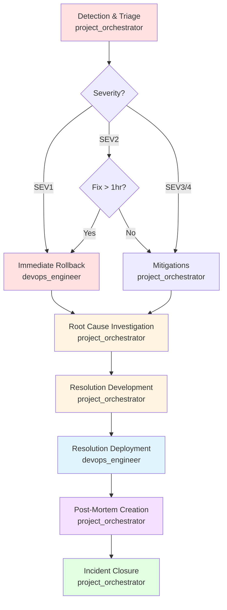

# Workflow: emergency_recovery

## Description
The emergency_recovery workflow defines the incident response process for production issues, from detection through containment, investigation, resolution, and post-mortem. This workflow is activated for SEV1 and SEV2 incidents to minimize damage and restore service quickly.

## Trigger
This workflow is triggered by:
- The `/recover` command
- Production incident detection (monitoring alerts)
- User-reported production issues
- SEV1 or SEV2 incident declaration

## Stages

### Stage 1: Incident Detection & Triage (project_orchestrator)
**Purpose:** Detect incident, assess severity, and begin triage.

**Steps:**
1. Receive incident alert or report
2. Assess incident severity (SEV1, SEV2, SEV3, SEV4)
3. Assess business and user impact
4. Assess scope (affected services, users, regions)
5. Assign incident owner
6. Activate incident communication channel
7. Begin incident timeline documentation

**Responsible Agent:** project_orchestrator

**Outputs:**
- Incident severity assessment
- Impact assessment
- Incident timeline (started)
- Communication channel activated

**Success Criteria:**
- Incident severity assessed within 5 minutes
- Impact assessment completed
- Communication channel activated
- Timeline documentation started

### Stage 2: Incident Containment (project_orchestrator)
**Purpose:** Contain incident to prevent further damage.

**Steps:**
1. For SEV1: Execute immediate rollback
2. For SEV2: Assess rollback vs mitigation (rollback if fix > 1 hour)
3. For SEV3/4: Implement mitigations
4. Execute rollback plan (if applicable)
5. Monitor rollback success
6. Verify service recovery
7. Communicate containment actions

**Responsible Agent:** project_orchestrator (with devops_engineer for rollback execution)

**Outputs:**
- Containment action report
- Rollback execution report (if applicable)
- Service recovery verification

**Success Criteria:**
- SEV1: Rollback initiated within 10 minutes
- SEV2: Containment decision within 15 minutes
- Service restored or contained
- Users communicated

### Stage 3: Root Cause Investigation (project_orchestrator)
**Purpose:** Investigate and identify root cause.

**Steps:**
1. Collect error logs and metrics
2. Collect database query logs
3. Collect external service logs
4. Analyze collected data
5. Identify root cause
6. Identify contributing factors
7. Consult specialist agents as needed
8. Verify hypothesis with tests

**Responsible Agent:** project_orchestrator (with specialist agent consultation)

**Outputs:**
- Root cause analysis report
- Data collection summary
- Hypothesis verification results

**Success Criteria:**
- Root cause identified
- Contributing factors understood
- Hypothesis verified

### Stage 4: Resolution Development (project_orchestrator)
**Purpose:** Develop and test permanent fix.

**Steps:**
1. Develop fix for root cause
2. Test fix in staging environment
3. Verify fix addresses root cause
4. Verify no regressions
5. Review fix with relevant specialists
6. Prepare fix deployment

**Responsible Agent:** project_orchestrator (with relevant specialist agents)

**Outputs:**
- Fix implementation
- Test results
- Deployment preparation

**Success Criteria:**
- Fix addresses root cause
- No regressions introduced
- Fix tested in staging

### Stage 5: Resolution Deployment (devops_engineer)
**Purpose:** Deploy fix to production and verify resolution.

**Steps:**
1. Deploy fix to production
2. Monitor deployment for errors
3. Verify incident resolved
4. Verify service health
5. Verify SLOs met
6. Monitor for side effects
7. Monitor for recurrence

**Responsible Agent:** devops_engineer

**Outputs:**
- Deployment execution report
- Resolution verification report
- Monitoring report

**Success Criteria:**
- Fix deployed successfully
- Incident resolved
- Service health restored
- SLOs met

### Stage 6: Post-Mortem Creation (project_orchestrator)
**Purpose:** Create post-mortem document and capture lessons.

**Steps:**
1. Compile incident timeline
2. Document impact assessment
3. Document root cause analysis
4. Document resolution steps
5. Document lessons learned
6. Create action items with owners
7. Review post-mortem with team
8. Store post-mortem in `docs/post-mortem/`

**Responsible Agent:** project_orchestrator

**Outputs:**
- Post-mortem document
- Lessons learned
- Action items with owners

**Success Criteria:**
- Post-mortem created within 48 hours
- Lessons documented
- Action items created and assigned
- Post-mortem reviewed

### Stage 7: Incident Closure (project_orchestrator)
**Purpose:** Close incident and complete documentation.

**Steps:**
1. Communicate resolution to stakeholders
2. Communicate resolution to users
3. Update status dashboards
4. Close incident communication channel
5. Record incident metrics (MTTD, MTTR)
6. Update incident metrics database
7. Track action items from post-mortem

**Responsible Agent:** project_orchestrator

**Outputs:**
- Incident closure report
- Incident metrics
- Action item tracking

**Success Criteria:**
- Stakeholders notified
- Users notified
- Incident metrics recorded
- Action items tracked

## Agents Involved

**Primary Coordinator:** project_orchestrator

**Specialist Agents (as needed):**
- backend_architect (backend issues)
- database_architect (database issues)
- devops_engineer (infrastructure issues, deployment)
- security_officer (security incidents)

**Consultation:** chief_engineer (for complex technical decisions)

## Diagram

## Success Criteria

1. **Detection:** Incident detected and triaged within SLA
2. **Containment:** Incident contained or rolled back within SLA
3. **Root Cause:** Root cause identified and understood
4. **Resolution:** Permanent fix developed and deployed
5. **Service Recovery:** Service restored to normal operation
6. **Post-Mortem:** Post-mortem created and reviewed
7. **Closure:** Incident closed and documented

## Failure Modes & Rollback

**If Detection Fails:**
- Failure: Incident not detected or triaged promptly
- Rollback: Enhance monitoring, improve alerting
- Prevention: Comprehensive monitoring, alert tuning

**If Containment Fails:**
- Failure: Rollback fails or mitigations ineffective
- Rollback: Escalate to chief_engineer, try alternative containment
- Prevention: Test rollback plans regularly, have multiple containment strategies

**If Investigation Fails:**
- Failure: Root cause cannot be identified
- Rollback: Escalate to chief_engineer, bring in external specialists
- Prevention: Enhanced logging, better observability

**If Resolution Fails:**
- Failure: Fix doesn't resolve issue or causes regressions
- Rollback: Rollback fix, investigate further, refine fix
- Prevention: Thorough testing in staging, peer review of fix

**If Post-Mortem Fails:**
- Failure: Post-mortem not created or blame culture emerges
- Rollback: Conduct post-mortem asynchronously, focus on process
- Prevention: Post-mortem template, blame-free culture

## Metrics

Record the following metrics in `.claude/memory/` after each incident:

**Incident Metrics:**
- Incident ID and severity
- Incident start and end time
- MTTD (Mean Time To Detect)
- MTTR (Mean Time To Resolve)
- Business impact (revenue, users affected)
- User impact (duration, severity)

**Response Metrics:**
- Time to triage
- Time to contain
- Time to identify root cause
- Time to develop fix
- Time to deploy fix
- Total resolution time

**Process Metrics:**
- Rollback success rate
- Post-mortem completion rate
- Action item completion rate
- Recurrence rate for similar incidents

**Trend Metrics:**
- Incident frequency over time
- MTTD trend
- MTTR trend
- Incident severity distribution

---

<!-- CASF v1.0 · generated 2026-08-06T22:51:00Z -->
