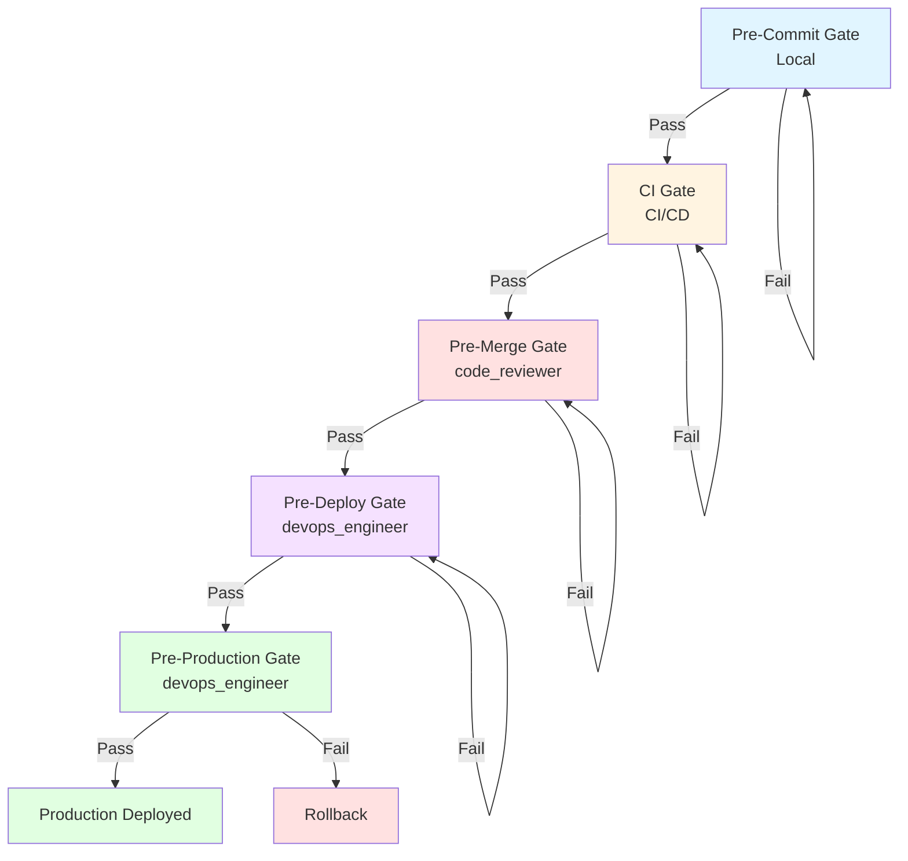

# Workflow: quality_gate

## Description
The quality_gate workflow defines the automated and manual quality checks that must be passed before code can be merged or deployed. This workflow enforces the Definition of Done and ensures all code meets the quality standards defined in CLAUDE.md.

## Trigger
This workflow is triggered by:
- Pre-commit hooks (local development)
- CI/CD pipeline on every push
- Pre-merge gate (before PR merge)
- Pre-deploy gate (before deployment to staging/production)
- Manual quality gate invocation

## Stages

### Stage 1: Pre-Commit Gate (Local)
**Purpose:** Catch issues before code is committed.

**Steps:**
1. Run linting (ESLint, Pylint, etc.)
2. Run formatting (Prettier, Black, etc.)
3. Run unit tests locally
4. Check for committed secrets
5. Check license compliance

**Responsible Agent:** Developer (automated via tools)

**Outputs:**
- Linting results
- Formatting results
- Unit test results
- Secret scan results
- License compliance results

**Success Criteria:**
- Linting passes
- Formatting passes
- Unit tests pass
- No secrets detected
- License compliance passes

**Failure Action:** Block commit, show errors, require fixes

### Stage 2: CI Gate (per PR)
**Purpose:** Comprehensive automated checks on every PR.

**Steps:**
1. Run all unit tests
2. Run integration tests
3. Verify coverage threshold met
4. Run security scan (Snyk, Dependabot)
5. Run dependency audit
6. Verify build succeeds
7. Verify performance budgets met
8. Run E2E tests (for critical changes)

**Responsible Agent:** CI/CD system (automated)

**Outputs:**
- Unit test results
- Integration test results
- Coverage report
- Security scan results
- Dependency audit results
- Build results
- Performance budget results
- E2E test results

**Success Criteria:**
- All unit tests pass
- All integration tests pass
- Coverage threshold met (80% minimum, 100% for critical paths)
- Security scan passes
- Dependency audit passes
- Build succeeds
- Performance budgets met
- E2E tests pass (if applicable)

**Failure Action:** Block PR, show failures, require fixes

### Stage 3: Pre-Merge Gate
**Purpose:** Final checks before PR is merged.

**Steps:**
1. Verify code review approved by at least one reviewer
2. Verify security officer approval (for security changes)
3. Verify chief_engineer approval (for architectural changes)
4. Verify documentation review approved
5. Verify all CI checks passing
6. Verify no unresolved conversations in PR

**Responsible Agent:** code_reviewer (coordinated by project_orchestrator)

**Outputs:**
- Code review approval status
- Security approval status
- Architecture approval status
- Documentation approval status
- CI check status
- Conversation resolution status

**Success Criteria:**
- Code review approved
- Security approval (if required)
- Architecture approval (if required)
- Documentation approval
- All CI checks passing
- No unresolved conversations

**Failure Action:** Block merge, show missing approvals, require resolution

### Stage 4: Pre-Deploy Gate (Staging)
**Purpose:** Verify deployment to staging is safe.

**Steps:**
1. Verify all CI checks passing
2. Deploy to staging
3. Run smoke tests on staging
4. Run performance tests
5. Run security scan on staging
6. Manual QA approval (for user-facing changes)

**Responsible Agent:** devops_engineer (with qa_engineer for tests)

**Outputs:**
- CI check status
- Staging deployment status
- Smoke test results
- Performance test results
- Security scan results
- Manual QA approval status

**Success Criteria:**
- All CI checks passing
- Staging deployment successful
- Smoke tests pass
- Performance tests pass
- Security scan passes
- Manual QA approved (if required)

**Failure Action:** Block production deployment, investigate failures

### Stage 5: Pre-Production Gate
**Purpose:** Final verification before production deployment.

**Steps:**
1. Verify all staging checks passing
2. Deploy to production (canary if applicable)
3. Verify canary deployment healthy (if applicable)
4. Monitor production deployment
5. Verify no errors in production
6. Verify SLOs not violated
7. Verify rollback plan tested

**Responsible Agent:** devops_engineer

**Outputs:**
- Staging check status
- Production deployment status
- Canary health status (if applicable)
- Production monitoring results
- SLO compliance status
- Rollback plan test status

**Success Criteria:**
- All staging checks passing
- Production deployment successful
- Canary healthy (if applicable)
- No errors in production
- SLOs not violated
- Rollback plan tested

**Failure Action:** Rollback production deployment, investigate issues

## Agents Involved

**Primary Coordinator:** code_reviewer (for pre-merge gate)

**Supporting Agents:**
- devops_engineer (CI/CD, deployment gates)
- qa_engineer (test execution)
- security_officer (security approvals)
- chief_engineer (architecture approvals)
- documentation_writer (documentation approvals)

## Diagram

## Success Criteria

1. **Pre-Commit:** Local checks pass before commit
2. **CI:** All automated checks pass on every PR
3. **Pre-Merge:** All approvals obtained and CI passing
4. **Pre-Deploy:** Staging deployment verified and tested
5. **Pre-Production:** Production deployment verified and healthy
6. **Overall:** No code merges or deploys without passing all applicable gates

## Failure Modes & Rollback

**If Pre-Commit Gate Fails:**
- Failure: Linting, formatting, or tests fail locally
- Rollback: Developer fixes issues locally before commit
- Prevention: Clear error messages, automated fixes where possible

**If CI Gate Fails:**
- Failure: Automated checks fail in CI/CD
- Rollback: Developer fixes issues and pushes new commit
- Prevention: Fast feedback, clear failure messages, local pre-commit gate

**If Pre-Merge Gate Fails:**
- Failure: Missing approvals or unresolved conversations
- Rollback: Obtain required approvals or resolve conversations
- Prevention: Clear approval requirements, automated reminders

**If Pre-Deploy Gate Fails:**
- Failure: Staging deployment or tests fail
- Rollback: Fix issues, redeploy to staging, re-test
- Prevention: Comprehensive staging tests, parity with production

**If Pre-Production Gate Fails:**
- Failure: Production deployment issues or SLO violations
- Rollback: Execute rollback plan immediately
- Prevention: Comprehensive staging testing, canary deployments, rollback readiness

## Metrics

Record the following metrics in `.claude/memory/` for quality gate performance:

**Gate Metrics:**
- Pre-commit gate pass rate
- CI gate pass rate
- Pre-merge gate pass rate
- Pre-deploy gate pass rate
- Pre-production gate pass rate

**Time Metrics:**
- Average CI gate execution time
- Average pre-merge gate time
- Average pre-deploy gate time
- Average pre-production gate time

**Failure Metrics:**
- Common failure reasons by gate
- Failure rate by gate
- Time to resolve failures by gate

**Quality Metrics:**
- Defect escape rate (bugs found after merge)
- Rollback rate (production rollbacks)
- Code review coverage (percentage of code reviewed)

---

<!-- CASF v1.0 · generated 2026-08-06T22:51:00Z -->
