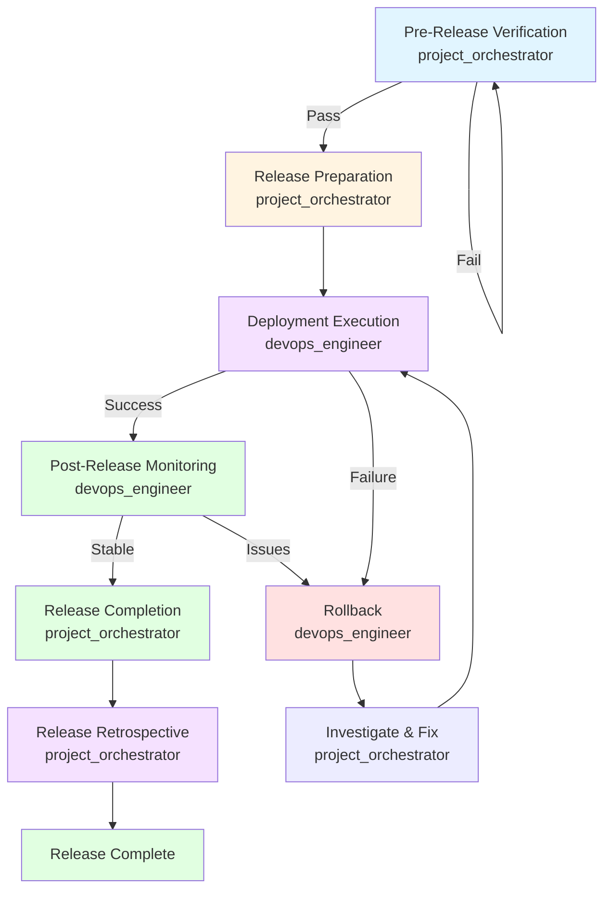

# Workflow: release_workflow

## Description
The release_workflow defines the process for releasing software from a green main branch to production deployment with rollback safety. This workflow manages versioning, changelog updates, quality gates, deployment execution, and post-release monitoring.

## Trigger
This workflow is triggered by:
- The `/ship` command
- Manual release initiation by project_orchestrator
- Scheduled release (if following release calendar)

## Stages

### Stage 1: Pre-Release Verification (project_orchestrator)
**Purpose:** Verify all pre-release requirements are met.

**Steps:**
1. Verify main branch is green (all quality gates passing)
2. Verify release branch exists and is stabilized
3. Verify all CI/CD checks pass
4. Verify security scans pass
5. Verify performance budgets met
6. Verify test coverage requirements met
7. Verify license compliance
8. Verify version number updated
9. Verify changelog updated
10. Verify release notes prepared
11. Verify rollback plan documented and tested
12. Verify post-release monitoring plan ready

**Responsible Agent:** project_orchestrator

**Outputs:**
- Pre-release verification report
- Quality gate status summary
- Release checklist verification

**Success Criteria:**
- All quality gates pass
- All checklist items complete
- Rollback plan tested and ready

**Failure Action:** Block release, address failures, re-verify

### Stage 2: Release Preparation (project_orchestrator)
**Purpose:** Prepare release artifacts and documentation.

**Steps:**
1. Update version number following SemVer
2. Create version tag
3. Push tag to remote
4. Finalize CHANGELOG.md
5. Verify all changes documented
6. Categorize changes (Added, Changed, Deprecated, Removed, Fixed, Security)
7. Reference issue/PR numbers
8. Generate release notes from changelog
9. Add upgrade/migration guides if needed
10. Add known issues if any
11. Prepare communication materials

**Responsible Agent:** project_orchestrator (with documentation_writer)

**Outputs:**
- Version tag
- Finalized CHANGELOG.md
- Release notes
- Communication materials

**Success Criteria:**
- Version tagged and pushed
- Changelog finalized
- Release notes prepared
- Communication materials ready

**Failure Action:** Fix versioning or changelog issues, re-prepare

### Stage 3: Deployment Execution (devops_engineer)
**Purpose:** Execute deployment with rollback safety.

**Steps:**
1. Verify production deployment window available
2. Execute canary deployment (if applicable)
   - Deploy to canary subset (e.g., 10% of traffic)
   - Monitor canary for errors
   - Verify SLOs not violated
   - Gradually increase traffic if healthy
3. Execute full deployment
   - Deploy to production
   - Monitor deployment for errors
   - Verify health checks pass
   - Verify monitoring indicates normal operation
4. Post-deployment verification
   - Run smoke tests on production
   - Verify critical user journeys work
   - Verify SLOs not violated
   - Verify no performance regressions

**Responsible Agent:** devops_engineer

**Outputs:**
- Deployment execution report
- Canary monitoring results (if applicable)
- Post-deployment verification report

**Success Criteria:**
- Deployment successful
- Health checks passing
- Smoke tests passing
- SLOs not violated
- No performance regressions

**Failure Action:** Execute rollback plan, investigate issues

### Stage 4: Post-Release Monitoring (devops_engineer)
**Purpose:** Monitor release for issues and ensure stability.

**Steps:**
1. Immediate monitoring (first 30 minutes)
   - Monitor error rates
   - Monitor latency
   - Monitor SLO compliance
   - Monitor alerting
2. Extended monitoring (24-48 hours)
   - Continue monitoring all metrics
   - Watch for edge case issues
   - Monitor user feedback
   - Monitor system behavior under load
3. Rollback readiness
   - Keep rollback plan ready
   - Monitor for rollback triggers
   - Be prepared to rollback if issues detected

**Responsible Agent:** devops_engineer

**Outputs:**
- Immediate monitoring report
- Extended monitoring report
- Rollback readiness status

**Success Criteria:**
- No critical issues detected
- Error rates normal
- Latency normal
- SLOs met
- User feedback positive

**Failure Action:** Rollback if critical issues, hotfix for non-critical issues

### Stage 5: Release Completion (project_orchestrator)
**Purpose:** Complete release process and finalize documentation.

**Steps:**
1. Mark release as complete
2. Archive release artifacts
3. Update documentation if needed
4. Record release decision in `.claude/memory/decisions.md`
5. Record any lessons learned in `.claude/memory/lessons_learned.md`
6. Update tech debt register if needed
7. Send release announcement
8. Share release notes with stakeholders
9. Update status dashboards

**Responsible Agent:** project_orchestrator (with documentation_writer)

**Outputs:**
- Release completion report
- Updated project memory
- Release announcement
- Updated status dashboards

**Success Criteria:**
- Release marked complete
- Artifacts archived
- Memory updated
- Announcements sent

**Failure Action:** Complete missing steps, ensure documentation updated

### Stage 6: Release Retrospective (project_orchestrator)
**Purpose:** Conduct brief retrospective to capture lessons.

**Steps:**
1. Conduct retrospective with team
2. Document what went well
3. Document what could be improved
4. Identify process improvements
5. Create action items for improvements
6. Assign owners and deadlines
7. Update lessons learned
8. Update runbooks if needed

**Responsible Agent:** project_orchestrator

**Outputs:**
- Release retrospective document
- Action items with owners
- Updated lessons learned
- Updated runbooks (if needed)

**Success Criteria:**
- Retrospective conducted
- Lessons documented
- Action items created and assigned
- Process improvements identified

**Failure Action:** Conduct retrospective asynchronously, document lessons

## Agents Involved

**Primary Coordinator:** project_orchestrator

**Supporting Agents:**
- devops_engineer (deployment and monitoring)
- documentation_writer (release notes and communication)
- code_reviewer (final quality verification)

**Consultation:** chief_engineer (for complex release decisions)

## Diagram

## Success Criteria

1. **Pre-Release:** All quality gates pass and checklist complete
2. **Preparation:** Version tagged, changelog finalized, release notes prepared
3. **Deployment:** Deployment successful with no errors
4. **Monitoring:** No critical issues detected in monitoring period
5. **Completion:** Release marked complete and artifacts archived
6. **Memory:** Project memory updated with release information
7. **Retrospective:** Retrospective conducted and documented

## Failure Modes & Rollback

**If Pre-Release Verification Fails:**
- Failure: Quality gates fail or checklist incomplete
- Rollback: Address failures, re-verify before proceeding
- Prevention: Comprehensive quality gates, early verification

**If Release Preparation Fails:**
- Failure: Versioning or changelog issues
- Rollback: Fix issues, re-prepare release
- Prevention: Versioning guidelines, changelog template

**If Deployment Fails:**
- Failure: Deployment errors or canary issues
- Rollback: Execute rollback plan immediately
- Prevention: Comprehensive staging testing, canary deployments

**If Post-Release Issues Detected:**
- Failure: Critical issues or SLO violations
- Rollback: Rollback immediately for critical issues
- Prevention: Comprehensive monitoring, quick rollback capability

**If Rollback Fails:**
- Failure: Rollback plan fails or doesn't resolve issues
- Rollback: Escalate to chief_engineer, emergency intervention
- Prevention: Test rollback plans regularly, have multiple rollback strategies

## Metrics

Record the following metrics in `.claude/memory/` for release performance:

**Release Metrics:**
- Release number and version
- Release date and time
- Deployment duration
- Canary duration (if applicable)
- Rollback occurrences
- Post-release issues

**Quality Metrics:**
- Pre-release verification time
- Quality gate pass rate
- Release preparation time
- Release notes completeness

**Deployment Metrics:**
- Deployment success rate
- Canary success rate (if applicable)
- Rollback success rate
- Time to rollback (if needed)

**Monitoring Metrics:**
- Post-release error rates
- Post-release latency
- SLO compliance post-release
- User feedback sentiment

**Process Metrics:**
- Total release time
- Retrospective insights
- Action items from retrospectives
- Process improvements implemented

---

<!-- CASF v1.0 · generated 2026-08-06T22:51:00Z -->
