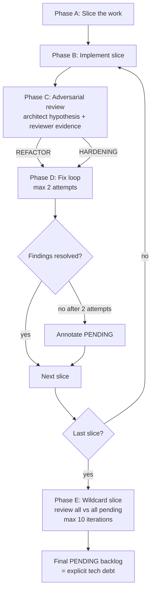

# Workflow: slice_review_workflow

## Description
This workflow defines how implementation work is divided into **slices** (checkpoints) and how each slice is validated through an **adversarial architecture review** before moving on. It encodes two ideas:

1. **Slices = checkpoints.** A slice is a self-contained, testable increment of work. You do not proceed to the next slice until the current one survives review (or its unresolved findings are explicitly parked).
2. **Adversarial review after implementation.** Once a slice (or the whole implementation) is done, two agents — the **architect** (in hypothesis mode) and the **architecture_reviewer** (evidence mode) — argue over whether the work is a solid foundation or a disposable draft, and converge on **refactor** vs **hardening**.

The implementation is treated as a **"cutre borrador"** (a rough draft): it can be broken and rebuilt, but every break must be justified by evidence and replaced by something strictly better.

## Trigger
- After a slice of implementation is declared complete (within `sprint_workflow` Stage 2).
- After the whole implementation of a feature/project is done (post-implementation step).
- Any time a generated app (CASF Studio) is about to be called "production-ready".

## Roles
- **architect** = `chief_engineer` (or `backend_architect`/`frontend_architect` for a domain slice) — enters **hypothesis mode**.
- **reviewer** = `architecture_reviewer` — reads code and tests hypotheses.
- **fixer** = the specialist who implements the fix (often the original author, or a delegated specialist).
- **coordinator** = `project_orchestrator` — owns the slice queue and the pending-findings ledger.

---

## Phase A — Slice the work (coordinator)
**Purpose:** turn the spec/plan into ordered, independently reviewable slices.

**Steps:**
1. Break the plan into slices. A slice is small enough to review in one pass, large enough to be meaningful (e.g. "auth", "points ledger", "QR check-in").
2. Order slices by dependency (foundations first).
3. For each slice, define its **acceptance criteria** and its **review hypotheses seed** (the architect's initial assumptions about it).
4. Record the slice list in `.claude/memory/progress.md` (or the sprint plan).

**Outputs:** ordered slice list with acceptance criteria.

## Phase B — Implement a slice (fixer)
**Purpose:** deliver one slice.

**Steps:**
1. The fixer implements the slice against its acceptance criteria.
2. The fixer adds tests for the slice.
3. The fixer marks the slice "ready for review".

**Constraint:** do not start the next slice until this slice passes Phase C or its findings are parked as PENDING.

## Phase C — Adversarial review of the slice (architect + reviewer)
**Purpose:** decide refactor vs hardening, with evidence.

**Steps:**
1. **Architect (hypothesis mode)** asks, ignoring the code: *¿es esta la mejor forma? ¿por qué alguien haría esto? ¿cuál era la intención?* — and writes a list of **falsifiable hypotheses**.
2. **Reviewer** goes to the code: reads it, traces intent vs implementation, runs/inspects tests, and marks each hypothesis **CONFIRMED / REFUTED / UNVERIFIED** with evidence (file:line).
3. The pair converge on a verdict:
   - **HARDENING** — solid enough; improve in place (list concrete items).
   - **REFACTOR** — not solid; break and rebuild (name the replacement shape and why it's better).

**Outputs:** hypothesis report + verdict + plan (hardening list or refactor shape) + unresolved findings.

## Phase D — Fix loop (fixer + reviewer)
**Purpose:** resolve the review findings.

**Rules:**
- Each slice gets **up to 2 fix attempts** per finding.
- **Attempt 1:** fixer addresses the findings; reviewer re-checks.
- **Attempt 2:** if a finding is still unresolved, the fixer gets one more targeted attempt.
- **After 2 attempts:** anything still unresolved is **annotated as PENDING** (recorded in the pending-findings ledger) and the slice proceeds. Do **not** loop forever inside a slice.

**Escalation:** if the fixer repeatedly fails the *same* problem, the reviewer **proposes a refactor as the fix** (break the offending piece) instead of a third cosmetic patch.

**Outputs:** resolved findings + PENDING findings (carried forward).

---

## Phase E — Wildcard slice (final, whole-implementation review)
**Purpose:** after the **last** slice, one more slice reviews **everything** against **all** pending findings plus anything new.

**Rules:**
- **Up to 10 review→fix iterations** in this slice.
- Pull in every PENDING finding from all previous slices.
- Re-run the full adversarial review over the whole implementation (not just the last slice).
- New findings that surface here are treated exactly like the pending ones.
- **After iteration 2** on a given finding: the reviewer may propose a **refactor as the fix** (see Phase D escalation).

**Termination:**
- The wildcard slice ends when no new findings remain **or** 10 iterations are exhausted.
- Anything still unresolved after 10 iterations is **annotated as PENDING (carried to backlog)** with a severity, owner, and why it could not be closed — it becomes explicit tech debt, not silent risk.

**Outputs:** closed findings + final PENDING backlog + a one-line refactor-vs-hardening summary per slice.

---

## Diagram

## Agents Involved
- **coordinator:** project_orchestrator
- **architect:** chief_engineer (or domain architect)
- **reviewer:** architecture_reviewer
- **fixer:** the owning specialist agent

## Success Criteria
1. Every slice passed Phase C before the next began.
2. Every finding is either **resolved** or **annotated PENDING** (nothing silently dropped).
3. Refactors are justified by evidence and name a concrete replacement shape.
4. The wildcard slice ran after the last slice and produced a final PENDING backlog.
5. The backlog is recorded in `.claude/memory/tech_debt.md` (owner, severity, why).

## Failure Modes & Rollback
- **Slice too big to review** → re-slice it; never skip the review.
- **Reviewer only reads summaries** → fail the review; the reviewer must read code.
- **Fix loop spinning on one finding** → reviewer proposes a refactor; after 2 attempts, park as PENDING.
- **PENDING pile ignored** → the wildcard slice exists precisely to force re-examination of every parked finding.
- **No wildcard slice** → a slice that "passed" early may still be broken; the whole-implementation review catches cross-slice regressions.

---

<!-- CASF v1.0 · generated 2026-09-22 -->
