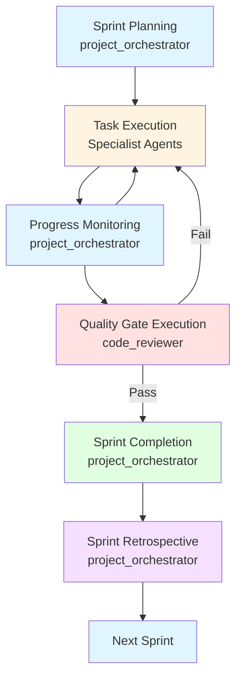

# Workflow: sprint_workflow

## Description
The sprint_workflow defines the full lifecycle of a sprint from planning through execution, quality gates, completion, and retrospective. This workflow is the operational backbone of the Build stage in the project lifecycle, ensuring that all sprint work meets quality standards and delivers value incrementally.

## Trigger
This workflow is triggered by:
- The `/new-sprint` command
- Manual initiation by the project_orchestrator
- Automatic initiation after Sprint 0 completion

## Stages

### Stage 1: Sprint Planning (project_orchestrator)
**Purpose:** Define sprint goals, break down tasks, and assign work.

**Steps:**
1. Review previous sprint outcomes (if applicable)
2. Define sprint goals with user input
3. Break down goals into actionable tasks
4. Estimate effort and identify dependencies
5. Assign tasks to specialist agents
6. Create sprint plan document

**Responsible Agent:** project_orchestrator

**Outputs:**
- Sprint plan document
- Task assignments with acceptance criteria
- Dependency graph

**Success Criteria:**
- Sprint goals clearly defined
- Tasks are actionable and estimates provided
- Dependencies identified and documented
- Specialist agents assigned with clear context

### Stage 2: Task Execution (Specialist Agents)
**Purpose:** Execute assigned tasks according to sprint plan.

**Steps:**
1. Specialist agents receive task assignments
2. Agents execute tasks following CLAUDE.md standards
3. Agents implement solutions with tests
4. Agents update documentation as needed
5. Agents report progress to project_orchestrator

**Responsible Agents:**
- backend_architect (backend tasks)
- frontend_architect (frontend tasks)
- database_architect (database tasks)
- security_officer (security tasks)
- qa_engineer (testing tasks)
- devops_engineer (infrastructure tasks)
- documentation_writer (documentation tasks)

**Outputs:**
- Implemented features and fixes
- Test suites with coverage reports
- Updated documentation
- Progress reports

**Success Criteria:**
- All tasks completed per acceptance criteria
- Code follows CLAUDE.md standards
- Tests meet coverage requirements
- Documentation is updated

### Stage 3: Progress Monitoring (project_orchestrator)
**Purpose:** Track progress, resolve blockers, and adjust plan as needed.

**Steps:**
1. Monitor task completion status
2. Identify and resolve blockers
3. Coordinate dependencies between tasks
4. Provide regular status updates to user
5. Adjust timeline or scope if needed

**Responsible Agent:** project_orchestrator

**Outputs:**
- Progress reports
- Blocker resolution records
- Timeline adjustments (if needed)

**Success Criteria:**
- Progress is visible and tracked
- Blockers are identified and resolved promptly
- User is informed of progress regularly
- Timeline adjustments are communicated

### Stage 4: Quality Gate Execution (code_reviewer)
**Purpose:** Enforce quality gates before sprint completion.

**Steps:**
1. Conduct code review of all changes
2. Verify Definition of Done compliance
3. Run automated quality gates
4. Verify test coverage requirements
5. Verify security scans pass
6. Return failing work for remediation

**Responsible Agent:** code_reviewer

**Outputs:**
- Code review report
- Quality gate pass/fail status
- Remediation requirements (if applicable)

**Success Criteria:**
- All code reviewed
- Definition of Done verified
- All quality gates pass
- No blocking issues remain

### Stage 5: Sprint Completion (project_orchestrator)
**Purpose:** Verify sprint completion and prepare deliverables.

**Steps:**
1. Verify all sprint goals met
2. Verify all tasks complete
3. Assemble deliverables
4. Update project memory
5. Prepare changelog entries

**Responsible Agent:** project_orchestrator

**Outputs:**
- Completed sprint deliverables
- Updated project memory
- Changelog entries

**Success Criteria:**
- All sprint goals achieved
- All tasks completed
- Deliverables assembled
- Project memory updated

### Stage 6: Sprint Retrospective (project_orchestrator)
**Purpose:** Conduct retrospective to capture lessons and improve process.

**Steps:**
1. Conduct retrospective with user
2. Document what went well
3. Document what didn't go well
4. Identify process improvements
5. Update lessons learned
6. Create action items for improvements

**Responsible Agent:** project_orchestrator

**Outputs:**
- Sprint retrospective document
- Updated lessons learned
- Action items with owners

**Success Criteria:**
- Retrospective conducted
- Lessons documented
- Action items created and assigned
- Process improvements identified

## Agents Involved

**Primary Coordinator:** project_orchestrator

**Specialist Agents (as needed):**
- backend_architect
- frontend_architect
- database_architect
- security_officer
- qa_engineer
- devops_engineer
- documentation_writer

**Quality Enforcement:** code_reviewer

## Diagram

## Success Criteria

1. **Planning Complete:** Sprint goals defined and tasks broken down
2. **Execution Complete:** All tasks completed per acceptance criteria
3. **Quality Gates Pass:** All quality gates pass before completion
4. **Deliverables Complete:** All sprint deliverables met
5. **Memory Updated:** Project memory updated with decisions and lessons
6. **Retrospective Complete:** Retrospective conducted and documented
7. **Process Improved:** Action items created for process improvements

## Failure Modes & Rollback

**If Planning Fails:**
- Failure: Sprint goals unclear or task breakdown incomplete
- Rollback: Re-engage user for clarification, adjust scope
- Prevention: Use bounded interview technique, validate understanding

**If Execution Fails:**
- Failure: Specialist agents blocked or tasks incomplete
- Rollback: Re-prioritize tasks, extend timeline, or adjust scope
- Prevention: Early blocker identification, regular progress monitoring

**If Quality Gates Fail:**
- Failure: Code review fails or quality gates don't pass
- Rollback: Return work to specialist agents for remediation
- Prevention: Early specialist engagement, continuous quality focus

**If Sprint Cannot Complete:**
- Failure: Sprint goals cannot be met due to blockers or timeline
- Rollback: Adjust sprint scope with user approval, defer tasks to next sprint
- Prevention: Realistic planning, buffer time for unknowns

**If Retrospective Skipped:**
- Failure: Retrospective not conducted or documented
- Rollback: Conduct retrospective asynchronously as soon as possible
- Prevention: Schedule retrospective as part of sprint completion

## Metrics

Record the following metrics in `.claude/memory/` after each sprint:

**Sprint Metrics:**
- Sprint number and duration
- Tasks planned vs completed
- Tasks blocked and resolution time
- Sprint completion percentage
- Definition of Done compliance rate
- Quality gate pass rate

**Quality Metrics:**
- Code review findings (blocking, non-blocking)
- Test coverage percentage
- Security scan results
- Performance budget compliance

**Process Metrics:**
- Planning time
- Execution time
- Quality gate time
- Retrospective insights
- Action items created and completed

**Trend Metrics:**
- Sprint velocity over time
- Blocker frequency
- Quality gate failure rate
- Tech debt accumulation rate

---

<!-- CASF v1.0 · generated 2026-08-06T22:51:00Z -->
